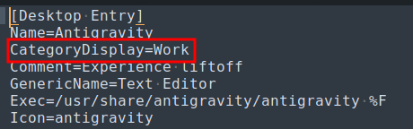

# Cinnamenu-metro

## Credits
This applet is a fork of the classic Cinnamenu applet [Cinnamenu](https://github.com/fredcw/Cinnamenu).

## License
This applet is licensed under the terms of the [GNU General Public License](https://www.gnu.org/licenses/gpl.html).

## Features
- Metro style applet
- App groups

### Preview

## How to install

1. Extract the folder `Cinnamenu@json` to `~/.local/share/cinnamon/applets/`.
2. Restart cinnamon.
3. Add the applet to the panel.

4. To create your own groups you'll need to edit your `.desktop` files and add the `CategoryDisplay` field to the `[Desktop Entry]` section. The value of the `CategoryDisplay` field will be the name of the group.
It was done this way to avoid user to create/manage a json file everytime there's a new app install or system update, you only need to do it once per app.

Note: To avoid the lost of your groups, you can copy your modified `.desktop` files to `~/.local/share/applications/` so the SO always use them instead of the system wide ones.

## Limitations
- By the moment the shortcut "ctrl+d" to open `.desktop` file does not work inside groups, only if you use the search bar to find the app and then press "ctrl+d".
- Groups are fixed to a maximum of 2 groups per row.