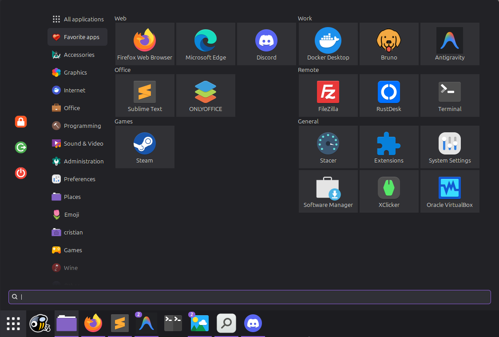

# Cinnamenu-metro

## ⚠️ NOTICE:
- This version `main` have some issues with multiple monitors, when you have the menu in both monitors, the menu doesn't open in the monitor you press "super key".
- Stable version is in the `stable` branch which is taken straight from [cinnamon-spices](https://cinnamon-spices.linuxmint.com/applets/view/322)

## 🌟 Features
- Metro style applet
- App groups

## 📸 Preview



## 🚀 How to Install

1. Extract the folder `Cinnamenu@json` into your local applets directory:
   ```bash
   ~/.local/share/cinnamon/applets/
   ```
2. Restart cinnamon. Press `Alt + F2`, type `r`, and press `Enter` to reload the desktop environment.
3. **Add to Panel:**  
   Right-click your panel, select **Applets**, find **Cinnamenu-metro**, and add it.\
   

## 📂 How to Create Your Own Groups

Instead of forcing you to manually manage a complex JSON file every time a new app is installed, this applet reads your groups natively from your application launchers.

1. **Edit the Launcher:**  
   Open your desired `.desktop` file and add the `CategoryDisplay` field inside the `[Desktop Entry]` section. The value will be the exact name of the group:
   ```ini
   [Desktop Entry]
   Name=Antigravity
   CategoryDisplay=Work
   ```

2. **💡 Pro Tip (Avoid losing your groups):**  
   To prevent system updates from overwriting your custom groups in `/usr/share/applications/`, copy your modified `.desktop` files to your user space:
   ```bash
   ~/.local/share/applications/
   ```
   The operating system will always prioritize your local versions over the system-wide ones.

---

## ⚠️ Known Limitations
- Currently the shortcut "ctrl+d" to open `.desktop` file does not work inside groups, only if you use the search bar to find the app and then press "ctrl+d".
- Groups are fixed to a maximum of 2 groups per row.


## ⚖️ Credits & License

* **Credits:** This applet is a modified fork of the classic [Cinnamenu](https://github.com/fredcw/Cinnamenu) applet by **fredcw**.
* **License:** This project is licensed under the terms of the **GNU General Public License v3.0 (GPL-3.0)**.