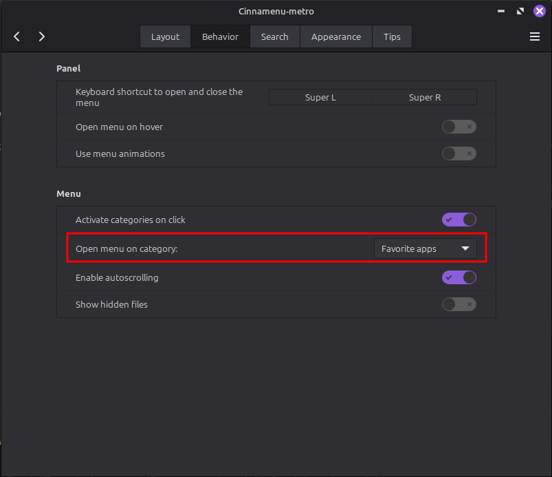
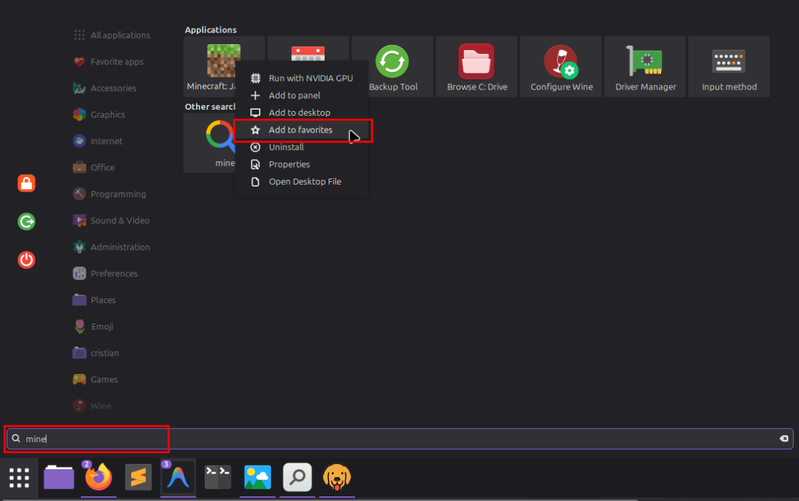
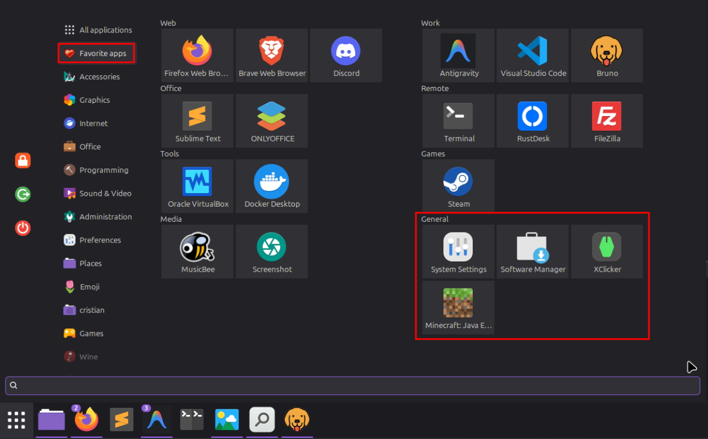
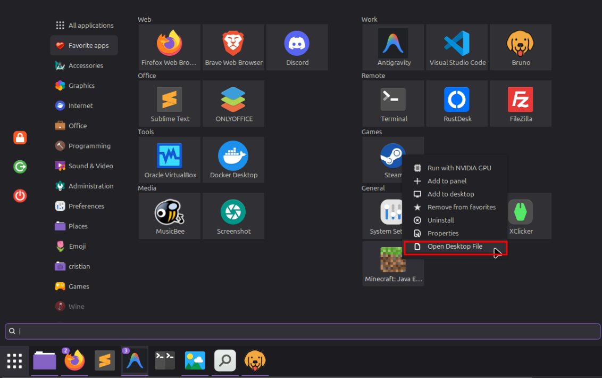
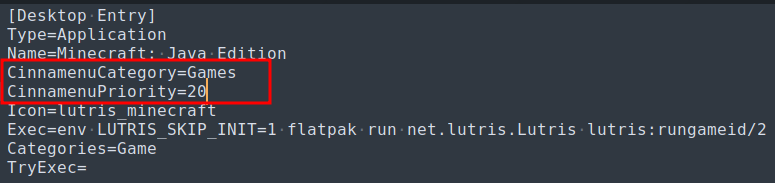
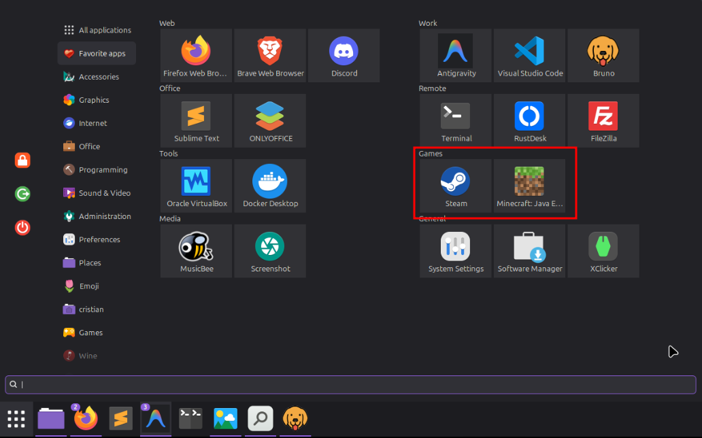

# Cinnamenu-metro

## 🌟 Features
- Metro style applet
- App groups
- App group priority
- Added context menu "Properties" and "Open Desktop File".

## 📸 Preview


## 🚀 How to Install

1. Extract the folder `Cinnamenu-metro@json` into your local applets directory:
   ```bash
   ~/.local/share/cinnamon/applets/
   ```
2. Restart cinnamon. Press `Alt + F2`, type `r`, and press `Enter` to reload the desktop environment.
3. **Add to Panel:**  
   Right-click your panel, select **Applets**, find **Cinnamenu-metro**, and add it.\
   

## 📂 How to Create Your Own Groups

Instead of forcing you to manually manage a complex JSON file every time a new app is installed, this applet reads your groups natively from your application launchers.

1. **Set favorites as default category.**\
   To emulate the behaviour of metro menu, we'll set favorite apps as the default category to display when the menu is opened.
   

2. **Set application as favorite.**\
   Right click on the application and select "Add to Favorites".
   .

3. **Go to favorites section**\
   You'll find your application in it.
   .

4. **Edit the Launcher:**
   4.1 Right click on the menu applet and select "Open Desktop File".\
     .\
   4.2 Add group name and priority to the .desktop file.\
     .
    ```ini
    [Desktop Entry]
   Name=Minecraft: Java Edition
   CinnamenuCategory=Games
   CinnamenuPriority=20
   ```
   4.3 Automatically the app will be added to the group you specified.
     .

5. **💡 Pro Tip (Avoid losing your groups):**  
   To prevent system updates from overwriting your custom groups in `/usr/share/applications/`, copy your modified `.desktop` files to your user space:
   ```bash
   ~/.local/share/applications/
   ```
   The operating system will always prioritize your local versions over the system-wide ones.

---

## ⚠️ Known Limitations
- Groups are fixed to a maximum of 2 groups per row.


## ⚖️ Credits & License

* **Credits:** This applet is a modified version of the classic [Cinnamenu](https://github.com/fredcw/Cinnamenu) applet by **fredcw**.
* **License:** This project is licensed under the terms of the **GNU General Public License v3.0 (GPL-3.0)**.